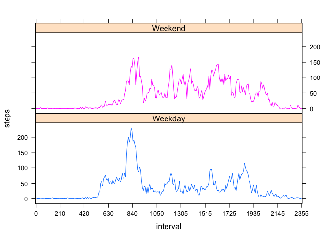

# Reproducible Research: Peer Assessment 1


## Loading and preprocessing the data

```r
# code assumes the .csv file is in the same working directory as the .Rmd file
df <- read.csv("activity.csv")

#convert date column to a "date" data type to aid later analysis.
df$date <- as.Date(as.character(df$date))
df$interval <- factor(df$interval)
```


## What is mean total number of steps taken per day?

```r
sum <- as.integer(tapply(df$steps, df$date, sum))
meansteps <- as.integer(mean(sum, na.rm = TRUE))  
mediansteps <- median(sum, na.rm = TRUE)
hist(sum, ylim = c(0,40), xlab = "Total Steps Per Day", main = "Histogram of Total Steps Per Day")
```

 

####The mean total number of steps per day is 10766.  

####The median total number of steps per day is 10765. 


## What is the average daily activity pattern?

```r
# create a vector that contains the average (across all days) for each 5 minute interval
average_steps <- tapply(df$steps, df$interval, mean, na.rm = TRUE)

# now make a dataframe paring each 5 minute interval to its' average
interval <- levels(df$interval)
intavgdf <- data.frame(interval, average_steps)
names(intavgdf) <- c("interval", "steps")

# which 5 minute interval has the highest average number of steps?
max <- subset(intavgdf, average_steps == max(average_steps))

plot(interval, average_steps, type = "l")
```

 

####The maximum number of steps (average = 206) occurs in interval 835.


## Imputing missing values

```r
df2 <- df

missing <- sum(is.na(df2$steps))
obs <- length(df$steps)
percent <- as.integer(missing/obs * 100)
```

####The data set (step count) has a total of 2304 missing values (coded as NA) out of a total of 17568 observations.

####Missing values represent 13% of the total data set.


```r
# first, make a vector of the averages that is the same length as orignal vector.
# we will use this to fill in "missing values" in the original data set.
avg <- rep(average_steps, 61)

# for each missing piece of data (NA) in the original data set,
# we want to replace the NA with the mean of other samples in the same interval.
for (i in 1:length(df2$steps)){
  if(is.na(df2$steps[i])){
    df2$steps[i] <- avg[i]
  }
}

sum2 <- as.integer(tapply(df2$steps, df2$date, sum))

hist(sum2, ylim = c(0,40), xlab = "Total Steps Per Day (w/ imputed data)", 
     main = "Histogram of Total Steps Per Day (w/ imputed data)")
```

 

```r
meansteps2 <- as.integer(mean(sum2))  
mediansteps2 <- median(sum2)
```

####The mean total number of steps per day (after imputing missing vals) is 10766.  

####The median total number of steps per day (after imputing missing vals) is 10766. 

#####Imputing missing data has no impact on the mean, and a very minor impact on the median calculation.  This is primarily due to the fact that the imputed data is not introducing any "new information".


## Are there differences in activity patterns between weekdays and weekends?

```r
df2$wd <- weekdays(df2$date)
for (i in 1:length(df2$wd)){
  if((df2$wd[i] == "Saturday")|(df2$wd[i] == "Sunday")) {
    df2$wd[i] <- "Weekend"
  }
  else{
    df2$wd[i] <- "Weekday"
  }
}
df2$wd <- factor(df2$wd)
library(lattice)

x.tick <- 12
labels <- interval[round(seq(1,length(interval), length.out = x.tick))]
at <- seq(1,length(interval), length.out = x.tick)

xyplot(steps ~ interval | wd, aggregate(steps ~ interval + wd, df2, FUN = mean), 
               layout = c(1, 2), type = "l", group = wd, scales = list(x=list(at=at, labels=labels)))
```

 

####The plots clearly demonstrate a different average step pattern on weekdays vs. weekends.  The subject tends to rise earlier on weekdays and follow a more established step pattern.   On weekends, the subjected tends to rise later and have a more random step pattern across the day.


